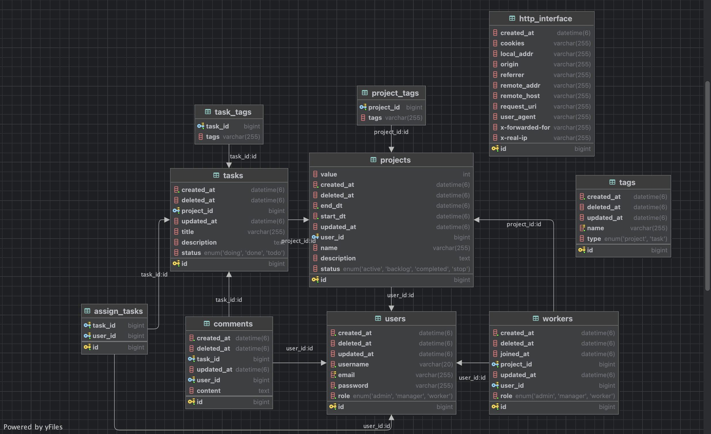

# Architectural Decision Record
## Database Relationship

### Table(Entity)
* User
* Project
* Task
* Comment
* Tag
* HttpInterface

---

### ERD(Entity Relationship Diagram)


---

### 1:N(reverse N:1)
```text
한 사람은 여러 개의 댓글을 작성할 수 있다
*  User -> Comment
```

```text
한 프로젝트는 여러 개의 작업들을 가질 수 있다
* Project -> Task
```

### N:M
```text
여러 명의 사람이 여러 프로젝트에 참여할 수 있다
* User <-> Project
  -> Worker
```

```text
N개의 태스크에 M명의 유저를 할당시킬 수 있다
* Task <-> User
  -> AssignTask
```

### Non Related
```text
프로젝트, 태스크에 관련한 태그를 여러개 부여할 수 있다
* Tag
```

```text
서버로 인입되는 HttpServletRequest정보를 
HttpInterface 필드들로 파싱해서 저장한다
* HttpInterface
```

---

### Implementation
1. @ManyToMany, @JoinTable 사용을 지양함.  
(1:N) (N:1)의 관계와 추가 정보를 담기 위해 수동으로 중간 테이블을 생성

2. Tag에 대한 Relationship을 맺지 않음.  
Project나 Task와 생명주기를 같이하기 때문에 @ElementCollection을 사용  
(변경이 자주 일어나지 않고, 갯수도 적을 것이라 가정. 이유: update시 전체 데이터를 delete하고 insert)

3. 특정 값만 들어가야하는 필드의 경우 Enum을 적극 활용함.  
ordinal대신 name으로 추가(순서변경으로 인한 불일치 방지)

4. Index(Non Clustered)는 추후에 추가할 예정(TBD: to be determined)

