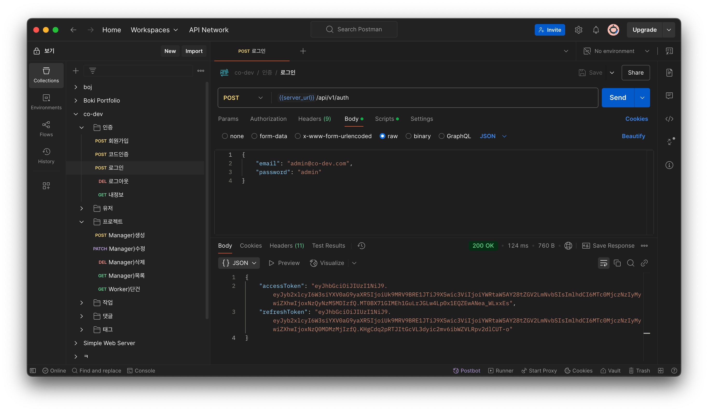
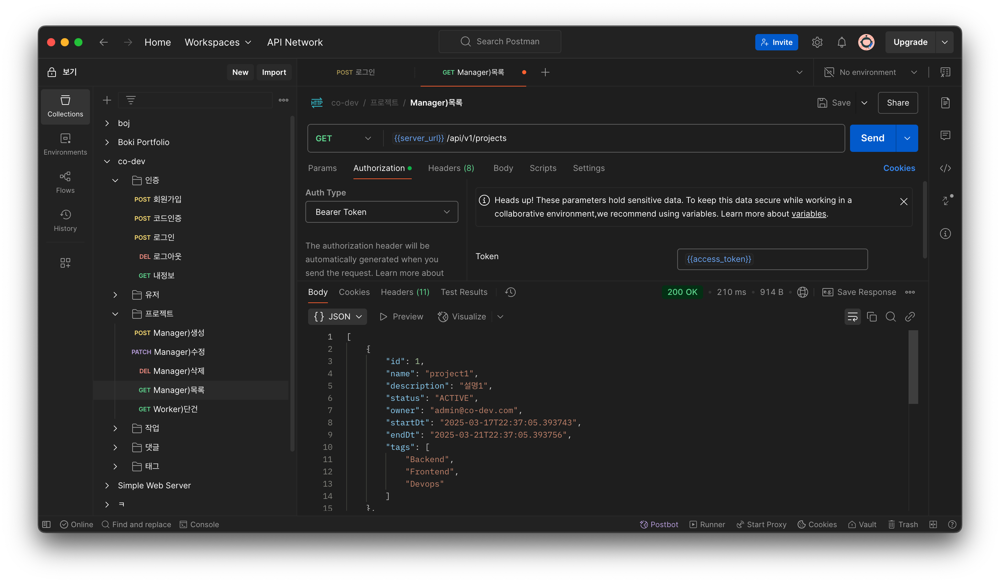

# REST API 구현

## Project
#### 목록 조회(GET) - 구현
- request url: `{{server_url}}/api/v1/projects`  
- response: 
```json
[
  {
    "id": 1,
    "name": "project1",
    "description": "설명1",
    "status": "ACTIVE",
    "owner": "admin@co-dev.com",
    "startDt": "2025-03-19T17:13:45.246652",
    "endDt": "2025-03-23T17:13:45.246693",
    "tags": [
      "Backend",
      "Frontend",
      "Devops"
    ]
  },
  {
    "id": 2,
    "name": "project2",
    "description": "설명2",
    "status": "BACKLOG",
    "owner": "admin@co-dev.com",
    "startDt": "2025-03-15T17:13:45.25016",
    "endDt": "2025-03-24T17:13:45.250163",
    "tags": []
  },
  {
    "id": 3,
    "name": "project3",
    "description": "설명3",
    "status": "COMPLETED",
    "owner": "admin@co-dev.com",
    "startDt": "2025-03-15T17:13:45.25029",
    "endDt": "2025-03-24T17:13:45.250292",
    "tags": []
  },
  {
    "id": 4,
    "name": "project4",
    "description": "설명4",
    "status": "ACTIVE",
    "owner": "manager1@co-dev.com",
    "startDt": "2025-03-15T17:13:45.250366",
    "endDt": "2025-03-24T17:13:45.250368",
    "tags": []
  },
  {
    "id": 5,
    "name": "project5",
    "description": "설명5",
    "status": "ACTIVE",
    "owner": "manager1@co-dev.com",
    "startDt": "2025-03-15T17:13:45.250442",
    "endDt": "2025-03-24T17:13:45.250444",
    "tags": []
  }
]
```
- imgs




#### 단건 조회(GET) - 구현
- request url: `{{server_url}}/api/v1/projects/4`
- response:
```json
{
  "id": 4,
  "name": "project4",
  "description": "설명4",
  "status": "ACTIVE",
  "owner": "manager1@co-dev.com",
  "startDt": "2025-03-15T17:13:45.250366",
  "endDt": "2025-03-24T17:13:45.250368",
  "tags": []
}
```
- imgs


---

#### 생성(POST) - 구현
- request url: `{{server_url}}/api/v1/projects`
```json
{
    "ownerId": 2,
    "name": "냥이프로젝트",
    "description": "new설명",
    "status": "ACTIVE",
    "startDt": "2025-03-26T00:00:00",
    "#endDt": "2026-03-26T09:00:00",
    "tags": [1,2,5,6,3,4]
}
```
- response:
```json
{
  "id": 6,
  "name": "냥이프로젝트",
  "description": "new설명",
  "status": "ACTIVE",
  "owner": "manager1@co-dev.com",
  "startDt": "2025-03-26T00:00:00",
  "endDt": null,
  "tags": [
    "Backend",
    "Frontend",
    "Mobile",
    "Devops"
  ]
}
```
- imgs
  

#### 수정(PATCH) - 구현
- request url: `{{server_url}}/api/v1/projects/6`
```json
{
  "description": "update설명",
  "status": "ACTIVE",
  "startDt": "2025-03-26T00:00:00",
  "#endDt": "2026-03-26T09:00:00",
  "tags": [1,2,5,6]
}
```
- response:
```json
{
  "id": 6,
  "name": "냥이프로젝트",
  "description": "update설명",
  "status": "ACTIVE",
  "owner": "manager1@co-dev.com",
  "startDt": "2025-03-26T00:00:00",
  "endDt": null,
  "tags": [
    "Backend",
    "Frontend"
  ]
}
```
- imgs
  

#### 삭제(DELETE) - 구현
- request url: `{{server_url}}/api/v1/projects/6`
- response: `204 No Content`
- imgs
  