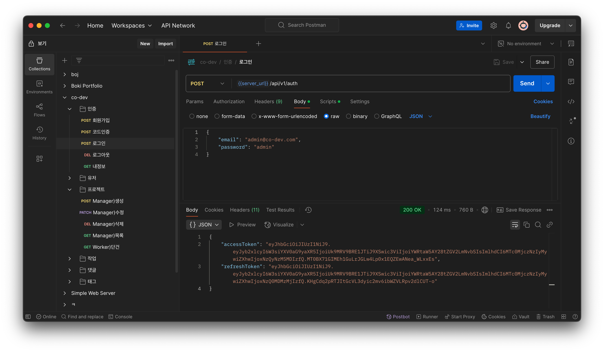
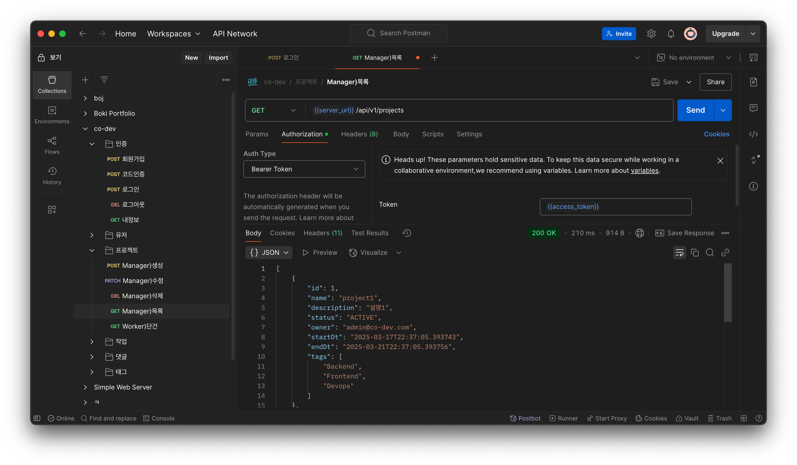
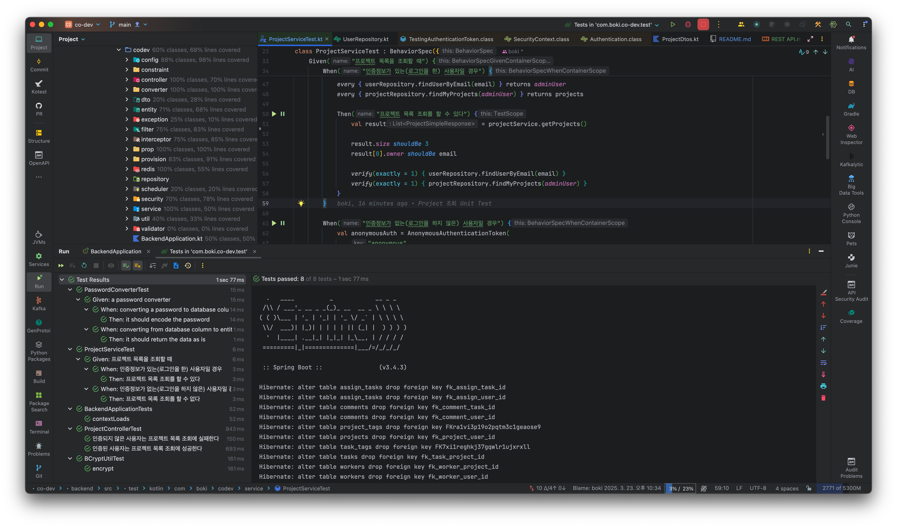
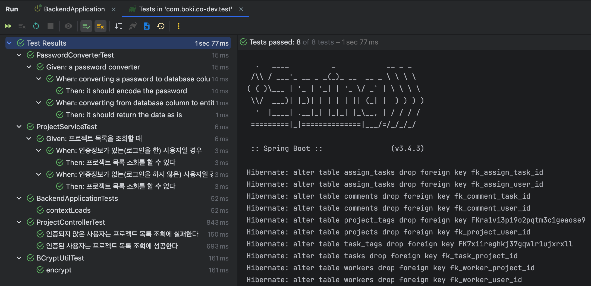

# REST API 구현

## Project
#### 조회(GET) - 개발
- request url: `{{server_url}}/api/v1/projects`  
- response: 
```json
[
  {
    "id": 1,
    "name": "project1",
    "description": "설명1",
    "status": "ACTIVE",
    "owner": "admin@co-dev.com",
    "startDt": "2025-03-17T22:37:05.393743",
    "endDt": "2025-03-21T22:37:05.393756",
    "tags": [
      "Backend",
      "Frontend",
      "Devops"
    ]
  },
  {
    "id": 2,
    "name": "project2",
    "description": "설명2",
    "status": "BACKLOG",
    "owner": "admin@co-dev.com",
    "startDt": "2025-03-13T22:37:05.396924",
    "endDt": "2025-03-22T22:37:05.396928",
    "tags": []
  },
  {
    "id": 3,
    "name": "project3",
    "description": "설명3",
    "status": "COMPLETED",
    "owner": "admin@co-dev.com",
    "startDt": "2025-03-13T22:37:05.397036",
    "endDt": "2025-03-22T22:37:05.397038",
    "tags": []
  }
] 
```
- imgs




#### 조회(GET) - 테스트
- mockk, kotest, fixture-monkey(naver) 사용
- imgs



---


